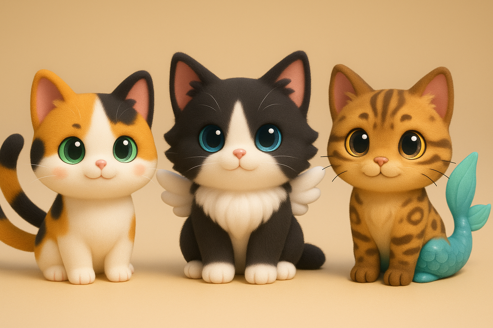
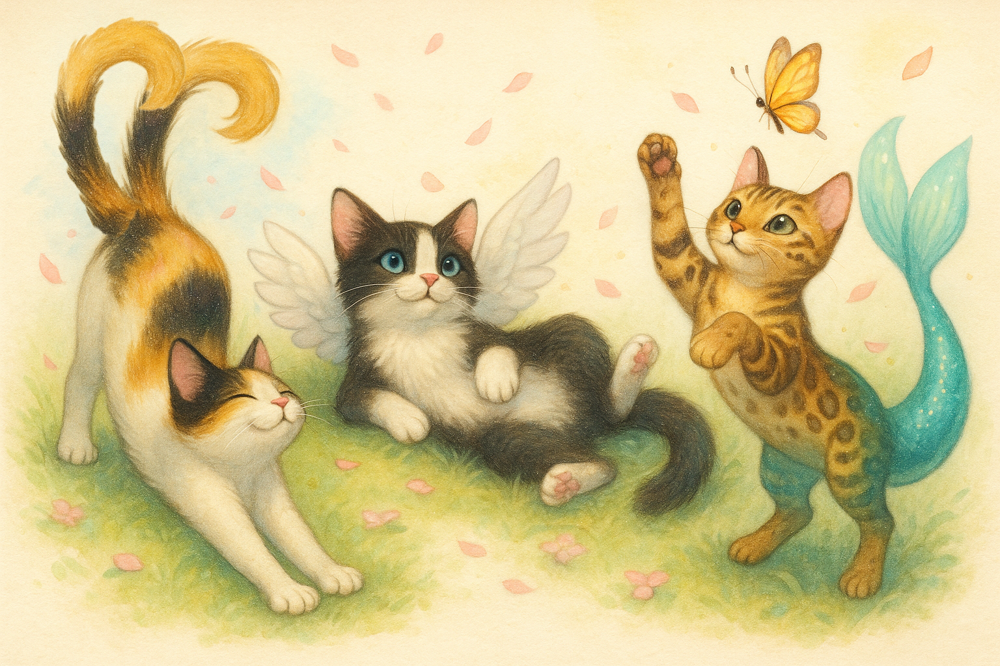

# Cozy Neko World

## Nome do Jogo: 
**Cozy Neko World** – *Título Temporário*

---

## Especificações Técnicas

### Aparência:
3D cute/kawaii em tons pastéis;

### Câmera:
Terceira pessoa (Ou Estilo Genshin, ou Estilo Animal Crossing)

### Plataforma: 
PC e Nintendo Switch ˜˜(a girl can dream, Ivan!)˜˜;

### Jogadores:
Single-Player;

### Gênero:
Cozy, Dating/Farming Simulator, Manipulação Genética;

---

## Objetivos

### Objetivo Principal:
Obter e manter o selo de 5 estrelas em sua fazenda por pelo menos 3 meses (in-game);

### Objetivos Secundários:
- Obter nível de amizade mínimo de “confiável” com todos os NPCs;
- Ter um relacionamento estável com pelo menos um NPC;
- Adquirir e manter pelo menos um animal de cada cor básica.

---

## Sistemas do Jogo:
- Sistema de Coleta de recursos no mundo;
- Sistema de Fazendinha para Produção de recursos;
- Sistema de Compra e Venda de recursos;
- Sistema de Compra e Venda de Pets;
- Sistema de Manipulação Genética dos Pets;
- Sistema de Breeding entre Pets;
- Sistema de Amizade/Romance com NPCs;
- Sistema de Avaliação da Fazenda.

---

## Visão Geral Essencial

### Resumo: 
O jogo é um farm/social-simulator com mecânicas de breeding para a conquista de animais de espécies, cores e genes de raridades diferentes. A compra e venda de recursos na cidade é importante uma vez que cada animal possui exigências diferenciadas de recursos para criar e manter.

### Aspectos Fundamentais:
- O jogador está numa cidade aconchegante e meiga, cujos moradores são dedicados à criação e manutenção de nekos mágicos;
- O jogador precisará aumentar a sua moral com a cidade para que possa comprar recursos mais variados e vender seus recursos por um maior valor;
- O jogador pode explorar o mundo para obter recursos, ou comprá-los na cidade;
- O jogador pode utilizar recursos para mudar os padrões na pelagem de seus pets, adquirindo animais que sejam cada vez mais agradáveis para seu gosto pessoal.

### Golden Nuggets: 
- O jogo proporciona gráficos numa temática meiga, proporção cute/kawaii e tons pasteis;
- As pelagens dos animais podem ser customizadas de forma a imitar o mundo real ou não;
- Os jogadores podem se expressar através da estética de suas fazendas e pets;
- O sistema de amizade/romance visa trazer vantagens ao jogador assim como maior customização de sua jornada;
- O relacionamento do jogador com os NPCs determina o end-game do jogo. 

### Referências Principais:
  
#### Mood/Aparência Geral: 

[Animal Crossing](https://animalcrossing.nintendo.com/new-horizons/), [Super Mario Odyssey](https://www.nintendo.com/pt-br/store/products/super-mario-odyssey-switch/?srsltid=AfmBOoohMS2JJBFibZcr_LlpDbggHP5b0NA7W8RTKTSQhZLM-pMdju8o) e [Kirby Forgotten Lands](https://www.nintendo.com/pt-br/store/products/kirby-and-the-forgotten-land-switch/?srsltid=AfmBOopiiC8G-ZpTDUBIwqemhdt_9BDHVc0lpF7GmetnnGM6spNmn8td);
  
#### Farming: 

[Stardew Valley](https://store.steampowered.com/app/413150/Stardew_Valley/) e [Cloud Meadow](https://store.steampowered.com/app/1223750/Cloud_Meadow/);
  
#### Exploração no World:

[Genshin Impact](https://genshin.hoyoverse.com/en/home) e [Infinity Nikki](https://store.steampowered.com/app/3164330/Infinity_Nikki/);

#### Manipulação Genética: 

[Flight Rising](https://www1.flightrising.com) e [Wajas](https://www.wajas.com/home_landing.php);
  
#### Dating Simulator: 

[Monster Prom](https://store.steampowered.com/app/743450/Monster_Prom/) e [MeChat](https://apps.apple.com/us/app/mechat-interactive-stories/id1536157979) (mostra se o personagem gostou ou não da interação e o status do relacionamento).

### Moodboard
(background).png)

---

## Contexto do Jogo

### História do Jogo:
- EM CONSTRUÇÃO -
O personagem principal está no ponto de ônibus, está calor e ele está cansado, seus olhos pesados... Ele está quase adormecendo quando vê um estranho gato com dois rabos (nekomata) atravessar a rua correndo, ele segue o gato através da grama alta e quando acha que está quase o alcançando... Cai em um grande buraco.
O interior do buraco é grande e a queda longa, o personagem principal cai por ele enquanto ultrapassa alguns itens, mas antes que ele acerte o chão, ele desmaia.
Ao acordar, o personagem se vê no centro de uma praça, o gato de duas caldas que ele estava perseguindo o observando de perto, ao se levantar, ele percebe um outro personagem humano(?) se aproximando.

### Eventos Anteriores:
- EM CONSTRUÇÃO -
Em relação à história do protagonista, gostaria de deixá-lo o mais "folha em branco" possível para que o jogador possa lhe atribuir o passado/personalidade que quiser.
Em relação ao mundo:
No mundo de XXX(Nome a ser definido), pessoas(?) e animais vivem em paz, numa comunidade otimista e auto-sustentável numa ilha flutuante(?). Entre esses animais existem alguns que são mágicos por natureza, descendentes dos deuses que regem XXX.
- Nekomatas(?), gatos de duas caudas descendentes do deus YYY, regente do solo fértil de XXX;
- Sunnies(?), gatos alados, descendentes do deus WWW, regente dos céus e do sol;
- Mercat(?), gatos-sereia com rabo de peixe, descendentes da deusa ZZZ, regente do mar e da luz.

---

## Objetos Essenciais ao Jogo

### Personagens:
#### Avatar do Jogador: 
O jogador pode escolher entre o avatar de protagonista feminino ou masculino, ambos possuem cabelo roxo, embora de tons e comprimentos diferentes.

#### NPCs:
- EM CONSTRUÇÃO -
- 1x Interesse Romântico BL
- 1x Interesse Romântico GL
- 2x Interesse Romântico Hetero
- 2x NPCs mais velhos não-dateaveis

#### Pets:

- Nekomata(?): Gato de duas caudas;
- Sunnies(?): Gato alado;
- Mercat(?): Gato sereia.

### Ferramentas:
- EM CONSTRUÇÃO -

### Estruturas:
- EM CONSTRUÇÃO -

### Objetos:
- EM CONSTRUÇÃO -

---

## Conflitos e Soluções:
- EM CONSTRUÇÃO -

---

## Inteligência Artificial:
- EM CONSTRUÇÃO -

---

## Fluxo do Jogo

Use the game play section to create a descriptive paragraph about how the game is played. You want the use tor imagine they are actually playing the game. Try not to use generic (i.e., broad, non-descriptive) terms when writing about the game play. For example, few readers want to hear statements such as, “enemy_1 will have more hit points than enemy_2.” Instead, it’s better to make statements like, “The Lazarus Fighter has more armour than the Apollo Fighter.”

### Outline do Fluxo do Jogo:

This outline will vary depending on the type of game.

- Opening the game application
- Game options
- Story synopsis
- Modes
- Game elements
- Game levels
- Player’s controls
- Winning
- Losing
- End
- Why is all this fun?

### Controles:
- EM CONSTRUÇÃO -

---

## DESIGN DOCUMENT

This document describes how GameObjects behave, how they’re controlled and their properties. This is often referred to as the “mechanics” of the game. This documentation is primarily concerned with the game itself. This part of the document is meant to be modular, meaning you could have several different Game Design Documents attached to the Concept Document.

### Design Guidelines

This is an important statement about any creative restrictions that need to be considered and includes brief statements about the general (i.e., overall) goal of the design.

### Game Design Definitions

This section established the definition of the game play. Definitions should include how a player wins, loses, transitions between levels, and the main focus of the gameplay.

### Game Flowchart

The game flowchart provides a visual of how the different game elements and their properties interact. Game flowcharts should represent Objects, Properties, and Actions present in the game. Each of these items should have a number reference to where they exist within the game mechanics document.

- Menu
- Synopsis
- Game Play
- Player Control
- Game Over (Winning and Losing)

### Player Definition

- Use this section for quick descriptions that define the player
- Use the Player Properties section (below) to define the properties for each player. Player Properties can be affected by the player’s action or interaction with other game elements. Define the properties and how they affect the player’s current game.
- Use the Player Rewards section to make a list of all objects that affect the player in a positive way. Define these objects by describing what affect they cause and how the player can use the object.

#### Player Definitions

A suggested list may include:

- Health
- Weapons
- Actions

#### Player Properties

Each property should mention a feedback as a result of the property changing.

#### Player Rewards (power-ups and pick-ups)

Make a list of all objects that affect the player in a positive way (e.g., health replenished).

### User Interface (UI)

This is where you’ll include a description of the user’s control of the game. Think about which buttons on a device would be best suited for the game. Consider what the worst layout is, then ask yourself if your UI is it still playable. A visual representation can be added where you relate the physical controls to the actions in the game. When designing the UI, it may be valuable to research quality control and user interface (UI) design information.

<small>Template based on Unity's GDD Template. Available at: [Unity's GDD Template](https://connect-prd-cdn.unity.com/20201215/83f3733d-3146-42de-8a69-f461d6662eb1/Game-Design-Document-Template.pdf)
